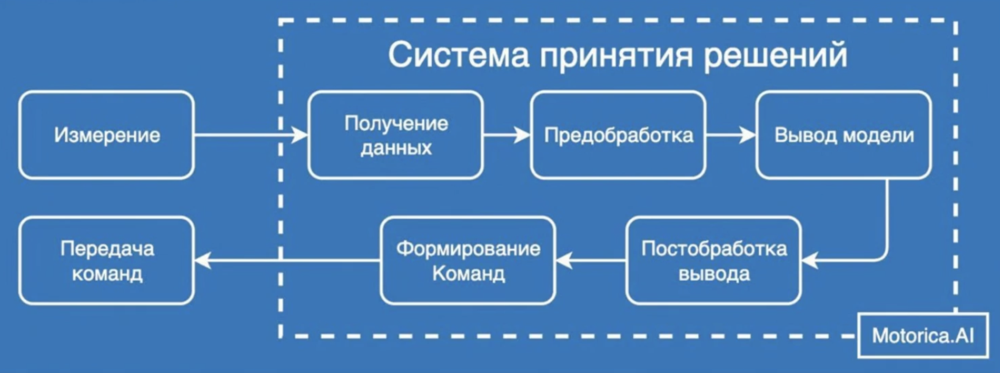

## Спринт 1

### Что сделано

1. **Данные [размечены](https://github.com/sidorov-works/motorica-gestures/tree/main/marked) по границам фактического выполнения жестов.** 

   Границы определялись по локальным максимумам суммарного **второго** градиента показаний датчиков.

   Подготовлены интерактивные [визуализации](https://github.com/sidorov-works/motorica-gestures/tree/main/fig/mark) получившихся разметок.

   Также выполнено разделение данных монтажей на тренировочные (файлы `.train`) и тестовые (файлы `.test`) в соответствии с условиями заказчика.

### Разные мысли

> Даже внутри монтажа показания датчиков на одинаковых жестах сильно **зависят от пронации.** 
>
> В наших данных пронация представлена тремя состояниями. Имеет смысл рассмотреть классификацию не на 6 классов, а на 18: 6 жестов * 3 варианта пронации.

> Будущая модель, какой бы она не была, не должна выдавать слишком частую смену жеста: невозможно в течение ограниченного количества таймстемпов несколько раз сменить жест.

> Рассмотреть вариант добавления класса (или нескольких классов), соответствующего переходам между жестами.

> Необходимо прояснить у заказчика: 
>
> - **Насколько частую смену жестов должна уметь отрабатывать модель?** Например, корректно распознать жест, по которому у нас будет окно хотя бы в $N=30$ измерений более реально, чем если смена жестов будет происходить чаще.
>
> - Какова общая допустимая задержка **системы принятия решения** на выполнение жеста? И какую часть от этой задержки в системе принятия решения занимают **получение данных** и **формирование команд**?
>
> 

> Возможно потребуется очистка данных (может быть, даже вручную): 
> - пилот мог отвлечься и опоздать с выполнением жеста
> - пилот мог перепутать жест и начать выполнять не то, что требовалось по команде

> Уровни датчиков на разных монтажах (отличаются пилоты, отличаются даты проведения измерений) могут принципиально различаться. Если предположить (пока что чисто эвристически), что датчики с высоким уровнем сигнала предпочтительнее для обучения модели, то ситуация складывается такая: в некоторых монтажах в ключевые (важные) признаки могут войти одни датчики, в то время как в других монтажах ключевым окажется уже другой набор датчиков.
>
> Идея: иметь в запасе несколько обученных моделей, отличающихся наборами признаков (датчиков, показания которых стали факторами модели). В момент калибровки, когда система принятия решений уже получает сигналы с датчиков и стало понятно, какие датчики сейчас дают высокий сигнал, выбрать наиболее подходящую модель на лету.